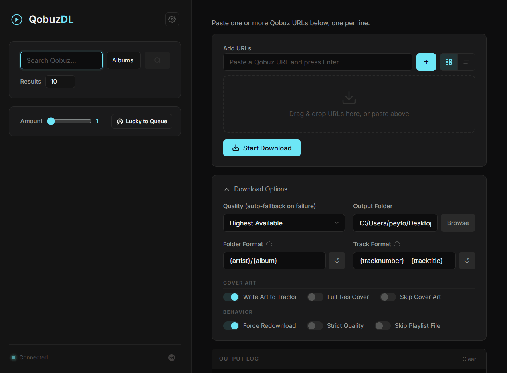

# Qobuz-DL: The Modern Music Experience


### Search, explore, and download Lossless and Hi-Res music from Qobuz with a beautiful, high-density interface.

---

## A Complete GUI Overhaul

This fork of **qobuz-dl** transforms the reliable downloader into a premium desktop-grade web application. Forget the terminal—experience your music collection with rich metadata, visual badges, and a streamlined workflow.

### Key Features
*   **High-Density Visuals**: View album art, "Explicit" content tags, and "Hi-Res" quality badges at a glance.
*   **Unified Download Queue**: Track multiple downloads in real-time with detailed metadata (Bit Depth, Sample Rate, Track Count, and Release Year).
*   **Advanced Metadata Resolution**: Every search result and queue item is enriched with granular technical details pulled directly from the Qobuz API.
*   **Native OAuth Support**: Seamlessly login using the official Qobuz website—no more manual token digging.
*   **Pro Configuration**: Manage your naming templates (Folder/Track) with interactive tooltips and instant examples.

### Lucky queue

Pick how many releases you want and add a random selection straight to the download queue—then start the download when you’re ready.



### Drag URLs from Qobuz

Drag album or track links from the Qobuz web player into the app to paste them into the URL list—no copy-paste needed.


---

## Getting Started

### 1. Installation
Install the package and its requirements via pip (from PyPI or your fork):

```bash
pip install --upgrade qobuz-dl
```

Or install from this repository:

```bash
pip install git+https://github.com/peykc/qobuz-dl-gui.git
```

### 2. Launch the Interface
**Windows:**
Run the included `launch_gui.bat` or:

```bash
qobuz-dl-gui
```

**Linux / macOS:**

```bash
./launch_gui.sh
# or
qobuz-dl-gui
```

The GUI runs as a **desktop window** (via [pywebview](https://github.com/r0x0r/pywebview); on Windows this uses **Edge WebView2**). If you set the environment variable `QOBUZ_DL_GUI_BROWSER=1`, the app opens in your **system browser** at `http://127.0.0.1` on a local port instead.

**Windows portable build:** Download `Qobuz-DL-GUI.exe` from [Releases](https://github.com/peykc/qobuz-dl-gui/releases) (no Python required). You need the [WebView2 Runtime](https://developer.microsoft.com/microsoft-edge/webview2/) if it is not already installed.

---

## Advanced Settings
The GUI provides a full **Configuration Manager** where you can:
- **Set Quality**: Toggle between MP3, CD Lossless, and Hi-Res (up to 24-bit/192kHz).
- **Custom Naming**: Use variables like `{artist}`, `{album}`, `{year}`, and `{bit_depth}` to organize your library exactly how you want.
- **Library Database**: Built-in duplicate checking ensures you never download the same track twice.

---

## Command Line Interface (CLI)
For power users who prefer the terminal or want to automate downloads via scripting, the full original CLI is still available.

[View CLI Documentation](CLI.md)

---

## ⚖️ Disclaimer
* This tool is for educational purposes. Please respect the [Qobuz API Terms of Use](https://static.qobuz.com/apps/api/QobuzAPI-TermsofUse.pdf).
* **qobuz-dl** is not affiliated with Qobuz.

---

### Support the Project

**Donate to GUI dev (Monero)**
[](https://peykc.github.io/pktree/?pay=monero)


**Donate to CLI dev (PayPal)**
[](https://www.paypal.com/cgi-bin/webscr?cmd=_s-xclick&hosted_button_id=VZWSWVGZGJRMU&source=url)
