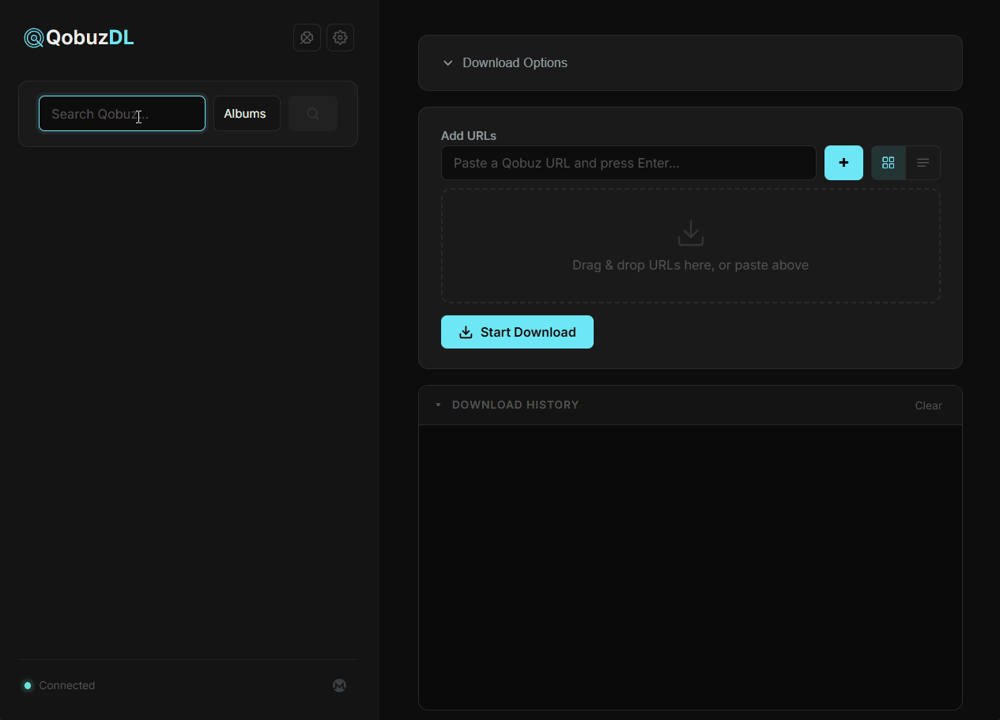
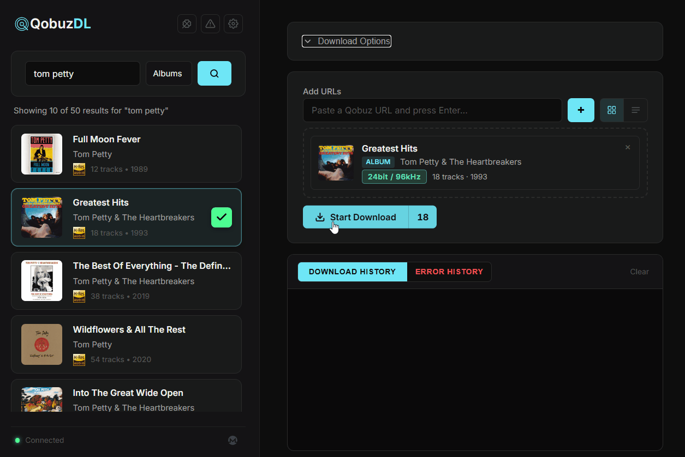
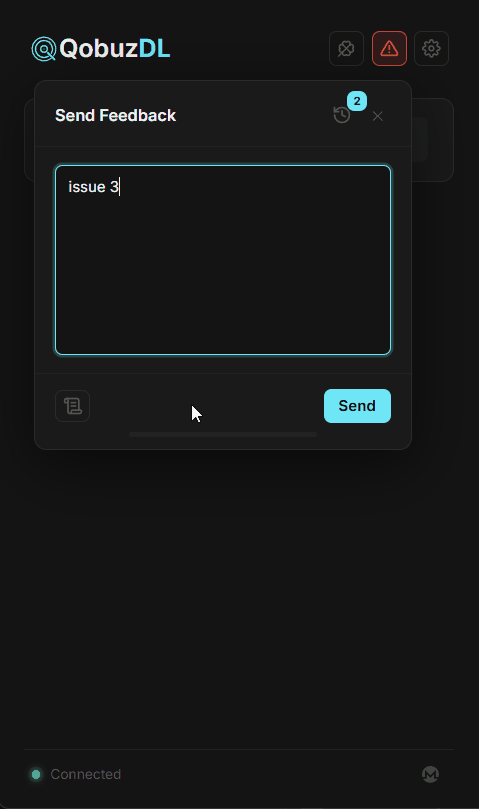

# Feature Guide

Qobuz-DL-GUI is built around a practical music-library workflow: find music, queue it quickly, download it with metadata, and resolve follow-up work like lyrics, purchase-only tracks, and naming rules without leaving the app.

## Search, Queue, And Download

Use the search panel to find albums, tracks, artists, playlists, and labels. Results include artwork, quality badges, release metadata, and queue controls.

## Drag From Qobuz

You can drag albums or tracks from the Qobuz website directly into Qobuz-DL-GUI. This is useful when browsing Qobuz normally and building a queue without copy-paste.

## Synced Lyrics

When lyrics are enabled, the app can search LRCLIB for synced `.lrc` files. The lyric search tool can preview results while playing the downloaded audio, making it easier to choose the right timed lyric file before attaching it.

## Replacement Tracks

Some Qobuz releases contain unavailable, wrong-edition, or purchase-only tracks. Qobuz-DL-GUI can search for a replacement track and attach it into the release layout so the album stays organized.

## Missing Track Placeholders

If no replacement is available, the app can create a `.missing.txt` placeholder in the album folder. This keeps the album structure clear and can include lyric-sidecar context when available.

## Settings And Naming Templates

Settings include account login, audio quality, duplicate handling, cover art, metadata tag behavior, lyrics, multi-disc layout, worker count, delay, and folder/track naming templates. Format fields include tooltips and examples for template variables.

## In-App Feedback

Use the built-in feedback tool to send issues or comments without opening GitHub or signing in there.

## Other Tools

- OAuth login through the official Qobuz website.
- Optional local download database for duplicate awareness.
- Queue persistence across app restarts.
- Lucky queue mode for adding top search results quickly.
- System-browser mode with `QOBUZ_DL_GUI_BROWSER=1`.
- In-app update checks and supported auto-updates on packaged Windows and Linux builds.
